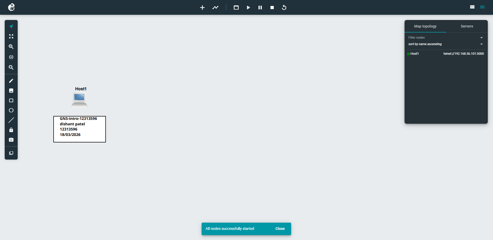
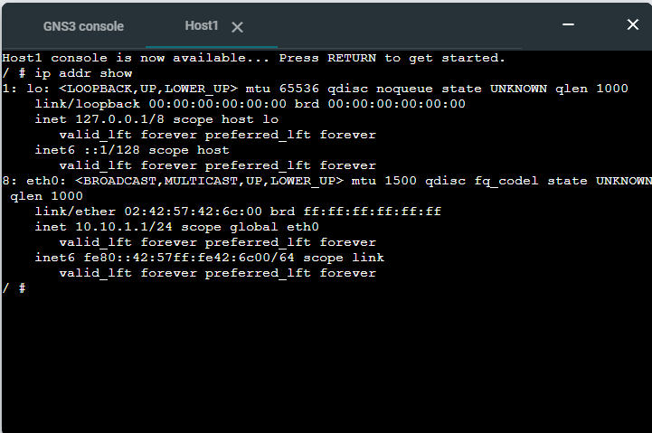

# GNS3 Intro Project Report

## Project Name

**GNS3-Intro-12313596**

---

## Student Details

* **Name:** Patel Dishant Mahendrakumar
* **Student ID:** 12313596
* **Unit:** COIT20261
* **Campus:** MELBOURNE

---

## Objective

The goal of this project was to get familiar with GNS3 by creating a simple network using a single Linux host. I configured a static IP address and verified that everything was working correctly using the console.

---

## Network Setup

For this task, I created a very basic setup with just one Linux host. I also added text labels in the workspace to clearly show the project title and my details.

The IP address I chose for the host was:

```
10.10.1.1
```

---

## Configuration Steps

### 1. Setting a Static IP Address

Before starting the node, I edited the `/etc/network/interfaces` file and added the following configuration:

```
auto eth0
iface eth0 inet static
    address 10.10.1.1
    netmask 255.255.255.0
```

This ensures the device always uses the same IP address.

---

### 2. Starting the Node

After saving the configuration, I started the Linux host in GNS3.

---

### 3. Opening the Console

I opened the web console in a new tab to interact with the host.

---

### 4. Verifying the IP Address

To confirm the configuration worked, I ran:

```
ip addr
```

The output showed that the `eth0` interface was correctly assigned the IP address **10.10.1.1**.

---

## Screenshots

### Network Topology



---

### IP Address Verification



---

## What I Learned

This project helped me understand the basics of using GNS3. I learned how to create and organise a project, add a Linux host, and configure its network settings.

I also got hands-on experience editing system files, assigning a static IP address, and using the terminal to verify configurations. One important takeaway was that network settings need to be configured before starting the device, otherwise they won’t apply correctly.

---

## Commands Used

* Edit network configuration:

  ```
  nano /etc/network/interfaces
  ```

* Restart networking service:

  ```
  /etc/init.d/networking restart
  ```

* Check IP address:

  ```
  ip addr
  ```

---

## Conclusion

Overall, the project was completed successfully. The Linux host was configured with a static IP address, and the setup was verified through the console. This exercise provided a solid introduction to basic networking in GNS3.

---
