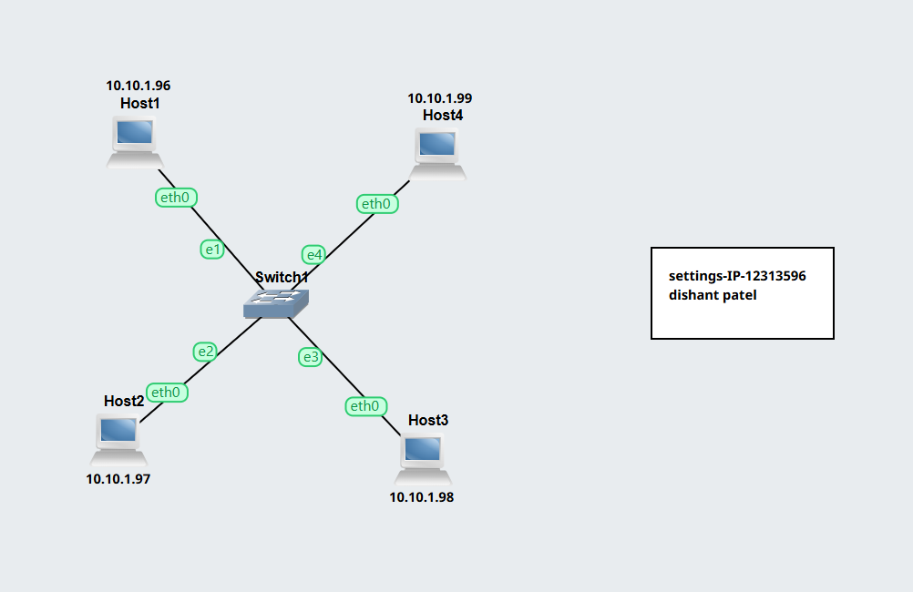
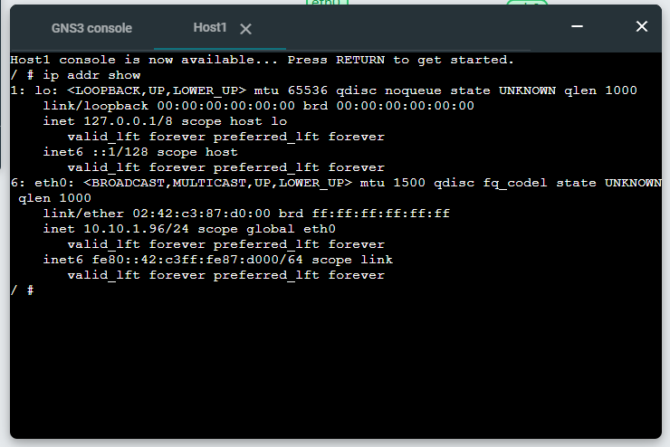
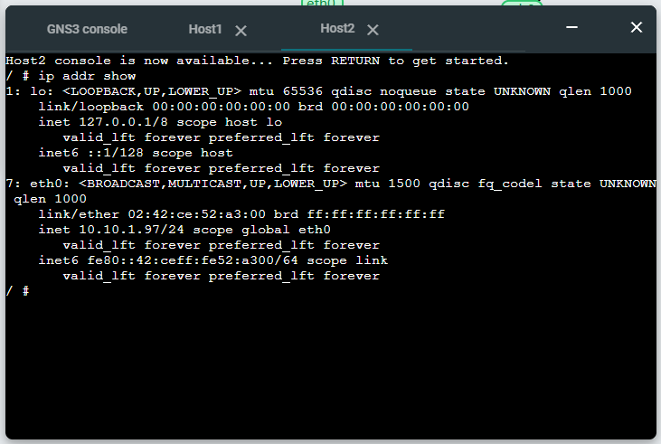
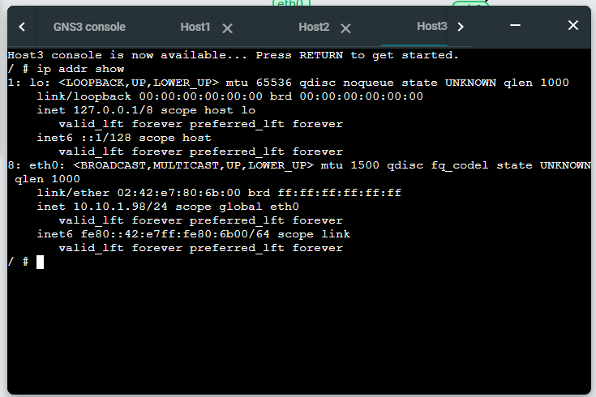
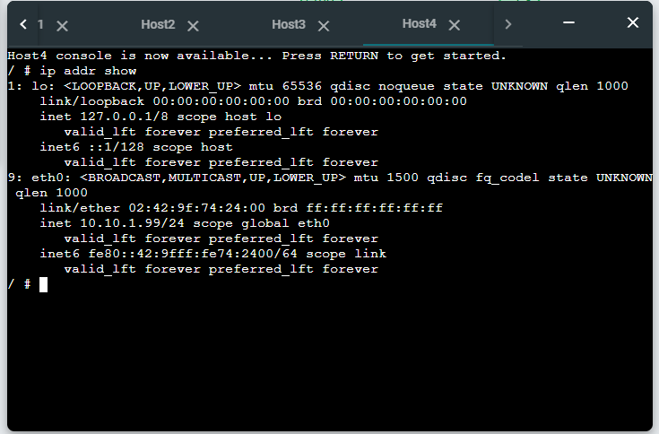
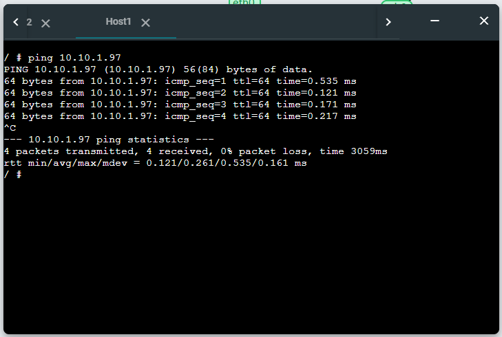
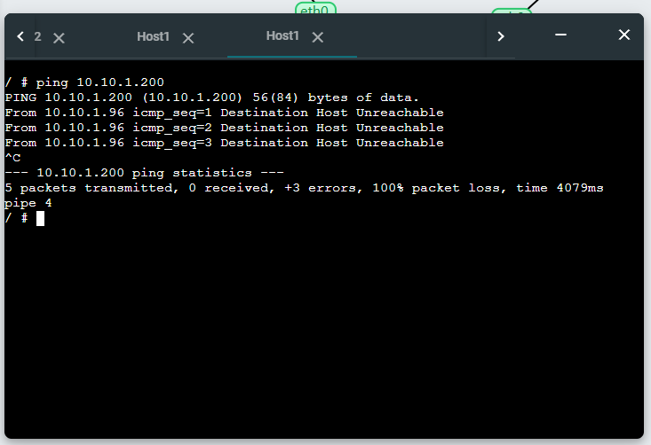
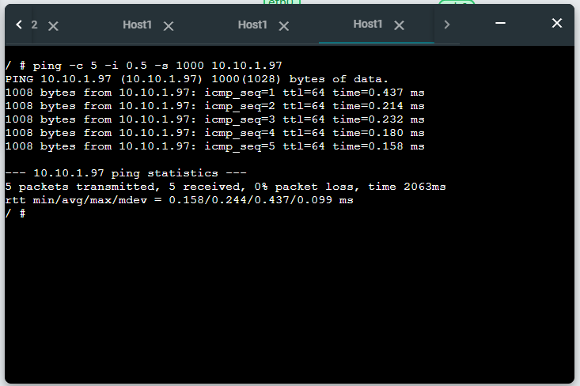

Here is your **updated Markdown report** with:

* Your actual IP addresses
* Your student ID
* Clearly placed image placeholders at the exact required sections

You can copy this directly into a `.md` file.

---

# Setting-IP-12313596 and Ping Basics Report

## Task 1: Setting Static IP Addresses

### Aim

To configure static IP addresses on Linux hosts using three different methods.

### Network Topology

* 4 × Linux Hosts (Host A, Host B, Host C, Host D)
* 1 × Ethernet Switch
* Network: `10.10.1.0/24`

### Network Diagram



---

### Configuration Methods

#### Method 1: Using GNS3 GUI

* Applied to:

  * Host A → `10.10.1.96/24`
  * Host B → `10.10.1.97/24`

Configured via:

* Right-click node → Configure → Network settings

---

#### Method 2: Editing `/etc/network/interfaces`

* Applied to:

  * Host C → `10.10.1.98/24`

**Steps:**

```bash
sudo nano /etc/network/interfaces
```

**Configuration:**

```bash
auto eth0
iface eth0 inet static
    address 10.10.1.98
    netmask 255.255.255.0
```

Restart networking:

```bash
sudo systemctl restart networking
```

---

#### Method 3: Using `ip` command

* Applied to:

  * Host D → `10.10.1.99/24`

**Command:**

```bash
sudo ip address add 10.10.1.99/24 dev eth0
```

---

### Verification

Check IP address on each host:

```bash
ip address show
```

---

### Outputs

#### Host A Output



#### Host B Output



#### Host C Output



#### Host D Output



---

## Task 2: Testing Network Connectivity and Delay with Ping

### Aim

To test connectivity and measure delay using the `ping` command.

---

### Basic Ping Test

Ping from Host A to Host B:

```bash
ping 10.10.1.97
```

Stop after at least 5 replies (Ctrl + C).

#### Output Screenshot



---

### Ping to Non-Existent IP

```bash
ping 10.10.1.200
```

#### Output Screenshot



---

### Ping with Options

```bash
ping -c 5 -i 0.5 -s 1000 10.10.1.97
```

#### Output Screenshot



---

### Explanation

* **Packet loss** indicates whether packets are reaching the destination.
* **RTT (Round Trip Time)** shows network delay.
* Changing options:

  * `-c` limits number of packets
  * `-i` changes interval between packets
  * `-s` changes packet size

---

## Conclusion

* Static IPs were successfully configured using three different methods.
* All hosts were able to communicate within the LAN.
* Ping was used to verify connectivity and measure delay.
* Different ping options demonstrated how network testing can be adjusted.


