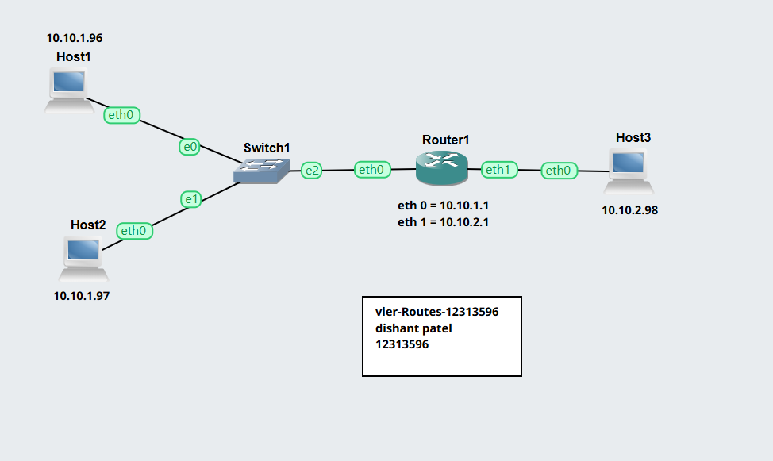
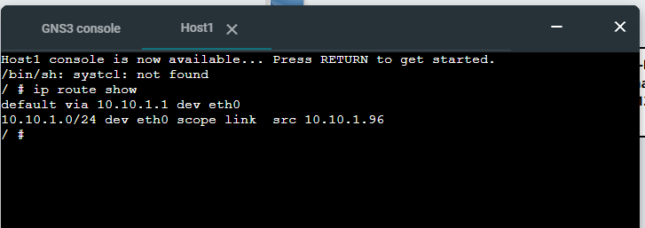
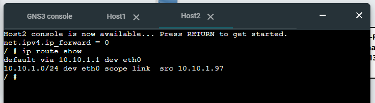
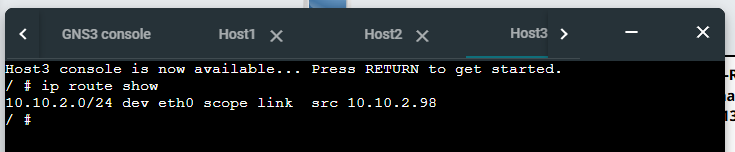
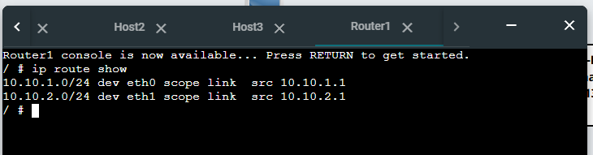

# View-Routes-12313596 and OSPF Basics Report

---

## Task 1: View Routing Tables

### Aim

To learn how to view routing tables and enable forwarding on a router.

---

### Network Topology

* 3 × Linux Hosts (Host A, Host B, Host C)
* 1 × Linux Router
* 1 × Ethernet Switch
* Two subnets created

Example addressing:

* Subnet 1: `10.10.1.0/24`
* Subnet 2: `10.10.2.0/24`

---

### Network Diagram



---

### IP Addressing Scheme

| Device | Interface | IP Address    |
| ------ | --------- | ------------- |
| Host A | eth0      | 10.10.1.96/24 |
| Host B | eth0      | 10.10.1.97/24 |
| Router | eth0      | 10.10.1.1/24  |
| Router | eth1      | 10.10.2.1/24  |
| Host C | eth0      | 10.10.2.98/24 |

---

### Enable / Disable Forwarding

#### On Router (Enable Forwarding)

```bash
echo 1 | sudo tee /proc/sys/net/ipv4/ip_forward
```

#### On Hosts (Disable Forwarding)

```bash
echo 0 | sudo tee /proc/sys/net/ipv4/ip_forward
```

---

### View Routing Tables

Command used on all devices:

```bash
ip route show
```

---

### Routing Table Outputs

#### Host A Routing Table



---

#### Host B Routing Table



---

#### Host C Routing Table



---

#### Router Routing Table



---

### Connectivity Testing

Example:

```bash
ping 10.10.2.10
```

* Successful replies confirm routing is working between subnets.

---

### Outputs

* Project file:
  `View-Routes-12313596.gns3project`

* Network screenshot:
  `View-Routes-12313596-network.png`

* Routing table evidence:
  (Screenshots above)

---

## Task 2: Dynamic Routing with OSPF

### Aim

To observe how dynamic routing works and adapts to network changes.

---

### Network Diagram


---

### Viewing OSPF Information

Run on FRR routers:

```bash
show ip ospf neighbor
```

```bash
show ip route
```

```bash
show ip ospf database
```

---

### Neighbour Routers (FRR1)


---

### Routing Tables (Two Routers)

#### Router 1


#### Router 2


---

### Routing Summary Table

| Router | Destination  | Next Node |
| ------ | ------------ | --------- |
| R1     | 10.10.2.0/24 | via R2    |
| R1     | 10.10.3.0/24 | via R3    |
| R2     | 10.10.1.0/24 | via R1    |
| R2     | 10.10.3.0/24 | via R3    |

*(Adjust based on your actual outputs)*

---

### Traceroute Before Link Failure

```bash
traceroute <destination-ip>
```


---

### Simulating Link Failure

* Stop a NETem node on the active path

---

### Traceroute After Link Failure

```bash
traceroute <destination-ip>
```


---

### Explanation

* OSPF automatically recalculates routes when a link fails
* New paths are selected based on shortest path (cost)
* Traceroute confirms the change in routing path

---

### Outputs

* Project file:
  `OSPF-Basics-12313596.gns3project`

* Network screenshot:
  `OSPF-Basics-12313596-network.png`

* OSPF neighbour output:
  `OSPF-Basics-12313596-neighbours.png`

* Routing tables:
  `OSPF-Basics-12313596-router1.png`
  `OSPF-Basics-12313596-router2.png`

* Traceroute outputs:
  `OSPF-Basics-12313596-trace-before.png`
  `OSPF-Basics-12313596-trace-after.png`

---

## Conclusion

* Routing tables show how packets are forwarded across networks.
* Enabling IP forwarding allows routers to pass traffic between subnets.
* OSPF dynamically updates routes when network topology changes.
* Traceroute is useful for verifying real packet paths.
