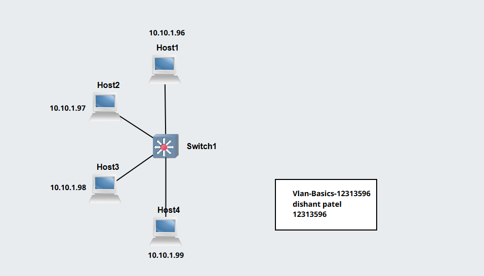
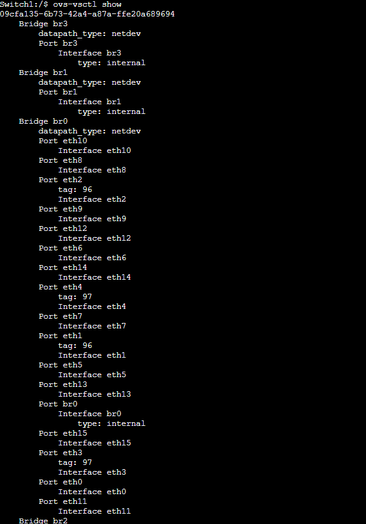
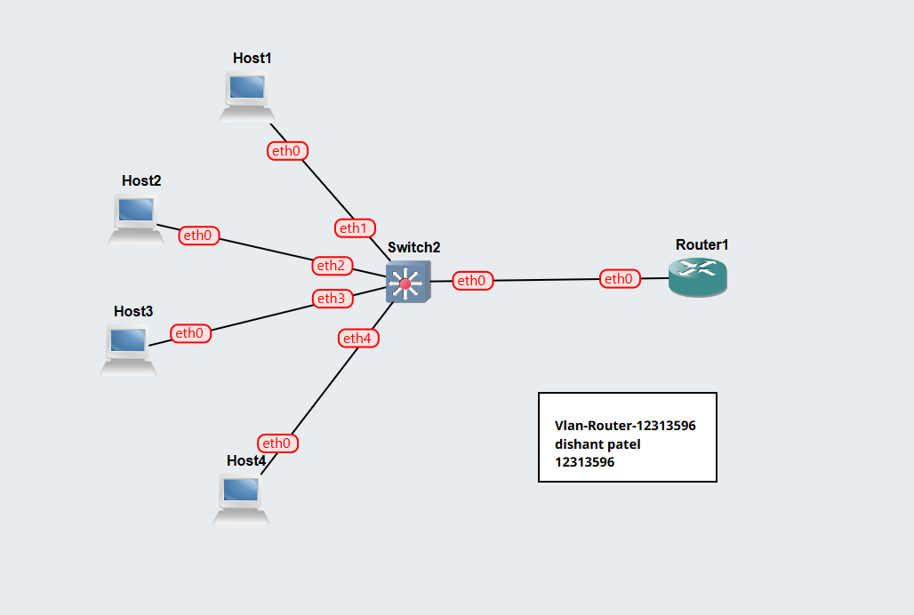
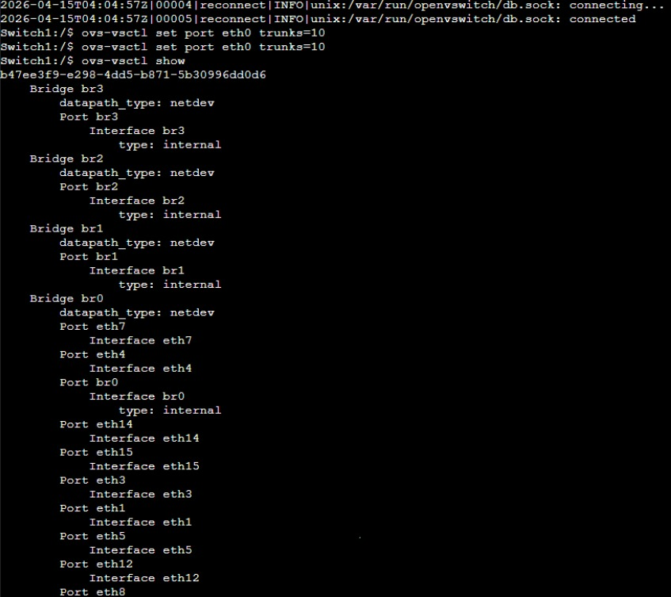

# Task 1: Setup VLANs on Switch

## Aim

To configure VLANs on a managed switch and separate network traffic between hosts.

---

## Network Topology

* 4 × Linux Hosts (Host A, B, C, D)
* 1 × Open vSwitch

All hosts connected to switch ports:

* Host A → eth1
* Host B → eth2
* Host C → eth3
* Host D → eth4

---

## Network Diagram



---

## Initial IP Configuration (Before VLANs)

All hosts in same subnet:

| Host   | IP Address    |
| ------ | ------------- |
| Host A | 10.10.1.96/24 |
| Host B | 10.10.1.97/24 |
| Host C | 10.10.1.98/24 |
| Host D | 10.10.1.99/24 |

---

## VLAN Configuration Plan

Based on Student ID: **12313596**
Last three digits: **596**

| VLAN     | Hosts          |
| -------- | -------------- |
| VLAN 96 | Host A, Host B |
| VLAN 97 | Host C, Host D |

---

## Switch VLAN Configuration (Open vSwitch)

Example commands:

```bash id="vlan1"
ovs-vsctl add-br switch
```

Assign ports:

```bash id="vlan2"
ovs-vsctl add-port switch eth1 tag=96
ovs-vsctl add-port switch eth2 tag=96
ovs-vsctl add-port switch eth3 tag=97
ovs-vsctl add-port switch eth4 tag=97
```

---

## Connectivity Test (Before VLANs)

```bash id="ping1"
ping 10.10.1.97
ping 10.10.1.98
```

---

## Connectivity Test (After VLANs)

### Expected Results:

| Test            | Result |
| --------------- | ------ |
| Host A ↔ Host B | Works  |
| Host C ↔ Host D | Works  |
| Host A ↔ Host C | Fails  |
| Host B ↔ Host D | Fails  |

---

## ARP Table Check

```bash id="arp1"
arp -n
```

---

## Switch Ports and VLAN Tags



---

## Outputs

* Project file: `Vlan-Basics-12313596.gns3project`
* Network screenshot: `Vlan-Basics-12313596-network.png`
* VLAN ports screenshot: `Vlan-Basics-12313596-ports.png`

---

---

# Task 2: VLANs on Router (Inter-VLAN Routing)

## Aim

To enable communication between VLANs using a router (Router-on-a-Stick).

---

## Network Topology

* 4 × Linux Hosts
* 1 × Open vSwitch
* 1 × Linux Router (connected to switch eth0 trunk)

---

## Network Diagram



---

## IP Addressing Scheme (Separated Subnets)

| Host   | VLAN     | IP Address    |
| ------ | -------- | ------------- |
| Host A | VLAN 96 | 10.10.1.96/24 |
| Host B | VLAN 96 | 10.10.1.97/24 |
| Host C | VLAN 97 | 10.10.2.96/24 |
| Host D | VLAN 97 | 10.10.2.97/24 |

---

## Switch VLAN Configuration

```bash id="vlan3"
ovs-vsctl add-br switch
ovs-vsctl add-port switch eth1 tag=96
ovs-vsctl add-port switch eth2 tag=96
ovs-vsctl add-port switch eth3 tag=97
ovs-vsctl add-port switch eth4 tag=97
```

---

## Configure Trunk Port (to Router)

```bash id="trunk1"
ovs-vsctl set port eth0 vlan_mode=trunk
ovs-vsctl set port eth0 trunks=96,97
```

---

## Router VLAN Sub-Interfaces

On Linux Router:

```bash id="router1"
ip link add link eth0 name eth0.96 type vlan id 96
ip link add link eth0 name eth0.97 type vlan id 97
```

Assign IPs:

```bash id="router2"
ip addr add 10.10.1.1/24 dev eth0.96
ip addr add 10.10.2.1/24 dev eth0.97
```

Enable interfaces:

```bash id="router3"
ip link set eth0 up
ip link set eth0.96 up
ip link set eth0.97 up
```

---

## Connectivity Testing

### Same VLAN:

```bash id="ping2"
ping 10.10.1.97
```

### Cross VLAN (via router):

```bash id="ping3"
ping 10.10.2.96
```

---

## Expected Results

| Test            | Result               |
| --------------- | -------------------- |
| Host A ↔ Host B | Success              |
| Host C ↔ Host D | Success              |
| Host A ↔ Host C | Success (via router) |
| Host B ↔ Host D | Success (via router) |

---

## Switch Ports and VLAN Tags



---

## Outputs

* Project file: `Vlan-Router-12313596.gns3project`
* Network screenshot: `Vlan-Router-12313596-network.png`
* VLAN ports screenshot: `Vlan-Router-12313596-ports.png`

---

## Conclusion

* VLANs successfully separated broadcast domains.
* Switch-based VLANs isolated traffic between groups.
* Router-on-a-stick enabled communication between VLANs.
* Trunk port carried multiple VLANs between switch and router.

