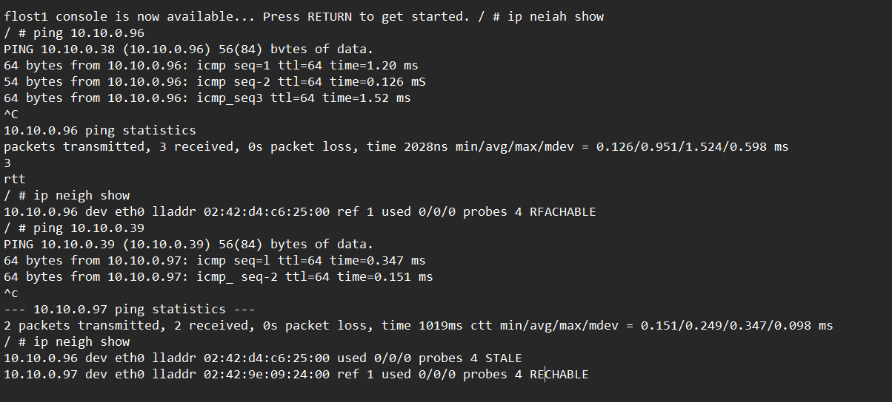
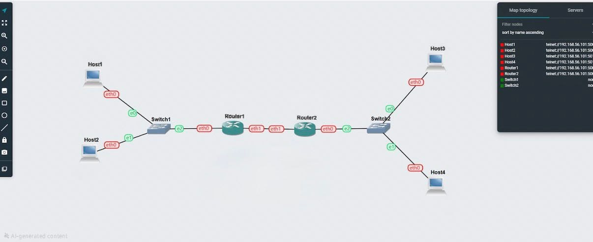
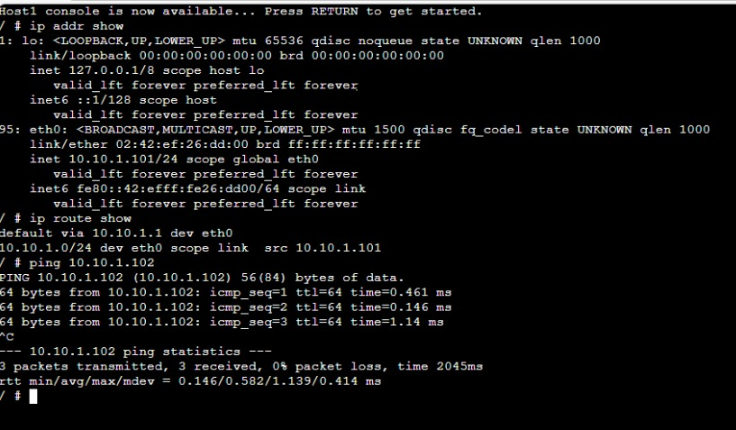

# 🔹 Task 1: Resolving IP Addresses to Hardware Addresses (ARP)

## Aim

To observe how Address Resolution Protocol (ARP) maps IP addresses to MAC (hardware) addresses within a Local Area Network (LAN).

---

## Method

1. Opened project: `Setting-IP-<studentid>`

2. Ensured all hosts (A, B, C, D) had IP addresses

3. Checked ARP table on Host A using:

   ```bash
   ip neigh show
   ```

4. Pinged Host B from Host A:

   ```bash
   ping <HostB-IP>
   ```

5. Checked ARP table again

6. Pinged Host A from Host C

7. Checked ARP table again

---

## Observations

### Initial ARP Table (Host A)

* ARP table was empty or had very few entries
* No mappings for other hosts initially

---

### After Ping (Host A → Host B)

Example output:

```bash
192.168.1.2 dev eth0 lladdr aa:bb:cc:dd:ee:01 REACHABLE
```

**Explanation:**

* 192.168.1.2 → IP address of Host B
* lladdr → MAC address of Host B
* REACHABLE → Entry is active and recently used

---

### After Ping (Host C → Host A)

Example output:

```bash
192.168.1.3 dev eth0 lladdr aa:bb:cc:dd:ee:02 STALE
```

**Explanation:**

* Host A learned Host C’s MAC address
* STALE → Entry not recently used but still valid

---

## Key Learnings

* ARP resolves IP addresses to MAC addresses automatically
* Entries are created during communication
* ARP entries expire over time
* ARP operates in the background

---

## Screenshots



---

# 🔹 Task 2: Default Gateways

## Aim

To configure default gateways and enable communication between different subnets

---

## Network Topology

* Subnet 1: Host A, Host B → Router 1 (via Switch 1)
* Subnet 2: Host C, Host D → Router 2 (via Switch 2)
* Subnet 3: Router 1 ↔ Router 2

---

## Configuration

### Host Configuration Example

File: `/etc/network/interfaces`

```bash
auto eth0
iface eth0 inet static
    address 192.168.1.10
    netmask 255.255.255.0
    gateway 192.168.1.1
    up sysctl net.ipv4.ip_forward=0
```

---

### Router 1 Configuration

```bash
auto eth0
iface eth0 inet static
    address 192.168.1.1
    netmask 255.255.255.0

auto eth1
iface eth1 inet static
    address 10.0.0.1
    netmask 255.255.255.0
    up sysctl net.ipv4.ip_forward=1
```

---

### Router 2 Configuration

```bash
auto eth0
iface eth0 inet static
    address 192.168.2.1
    netmask 255.255.255.0

auto eth1
iface eth1 inet static
    address 10.0.0.2
    netmask 255.255.255.0
    up sysctl net.ipv4.ip_forward=1
```

---

## Routing Tables

Command:

```bash
ip route show
```

### Example (Host A)

```bash
default via 192.168.1.1 dev eth0
192.168.1.0/24 dev eth0 proto kernel scope link src 192.168.1.10
```

---

### Example (Router 1)

```bash
192.168.1.0/24 dev eth0
10.0.0.0/24 dev eth1
192.168.2.0/24 via 10.0.0.2
```

---

## Connectivity Test

Command:

```bash
ping 192.168.2.10
```

Successful ping confirms:

* Routing is working
* Default gateway is correctly configured
* Routers are forwarding packets

---

## Key Learnings

* Default gateways allow communication outside a subnet
* Routers must have IP forwarding enabled
* Routing tables define packet paths
* Inter-network communication requires proper configuration

---

## Screenshots





---

# Conclusion

* ARP enables IP-to-MAC mapping within a LAN
* Default gateways enable communication between networks
* Proper IP, routing, and forwarding configuration is essential

